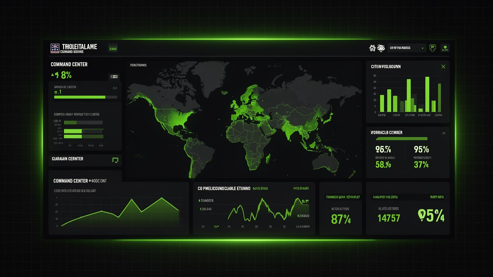
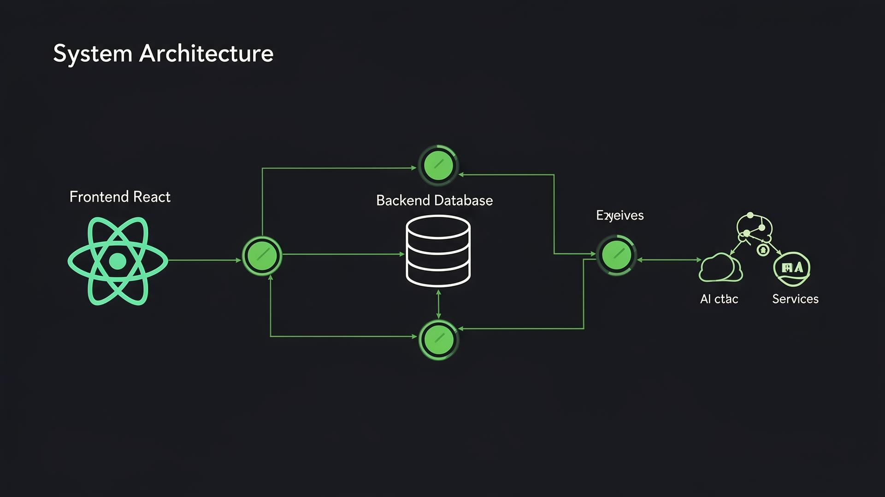
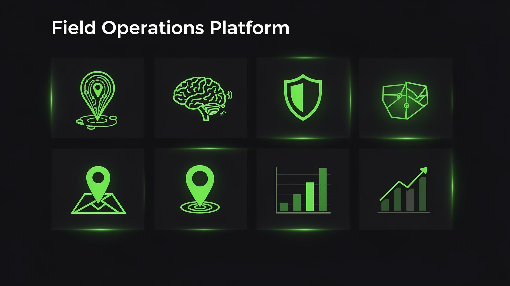

# 🛡️ FieldOPS — Political Field Intelligence Operating System



---

## 📌 Title

**FieldOPS** — A Real-Time Political Field Intelligence & Campaign Operations Platform

---

## ❗ Problem

Political campaigns and field operations face critical challenges:

- **Lack of real-time visibility** into ground-level worker activity, attendance, and task progress across hundreds of constituencies and thousands of booths.
- **Inefficient manual task assignment** leading to workload imbalance, worker burnout, and missed deadlines.
- **No centralized intelligence system** to detect fraud, analyze sentiment, predict readiness, or simulate election-day scenarios.
- **Zero accountability and traceability** — no immutable audit trails for field actions, making post-election analysis unreliable.
- **Disconnected communication channels** — broadcast alerts, feedback collection, and breach notifications are fragmented and delayed.
- **No geospatial awareness** — campaign managers cannot track worker locations, optimize routes, or enforce geo-fenced boundaries.

These gaps result in **wasted resources, strategic blind spots, and lost elections**.

---

## 💡 Solution

**FieldOPS** is a comprehensive, military-grade field intelligence platform that transforms political campaign operations through:

1. **Centralized War Room Dashboard** — Real-time KPIs, worker status, task completion rates, and alert feeds in a single command center.
2. **AI-Powered Task Assignment** — Intelligent matching of tasks to workers based on skills, location, experience, and current workload using AI models.
3. **GPS Tracking with Geo-Fencing** — Live worker tracking, custom geo-fence zones, route optimization, and automated breach notifications.
4. **Predictive Readiness Index** — AI-driven constituency and booth readiness scoring to identify weak spots before election day.
5. **Fraud Detection Engine** — Anomaly detection across attendance patterns, task completions, and performance metrics.
6. **Digital Twin Simulation** — Virtual election-day scenarios to stress-test strategies and resource allocation.
7. **Blockchain-Inspired Audit Ledger** — Immutable, hash-chained records of all field actions for complete traceability.
8. **Sentiment Analysis** — AI-powered feedback analysis to gauge worker and voter sentiment across districts.
9. **Burnout Detection** — Proactive monitoring of worker health indicators to prevent attrition.
10. **War Mode** — Emergency broadcast and rapid-response coordination during critical campaign moments.

---

## 🏗️ Architecture



```
┌─────────────────────────────────────────────────────────┐
│                    Frontend (React + Vite)               │
│  ┌─────────┐ ┌──────────┐ ┌──────────┐ ┌─────────────┐ │
│  │Dashboard │ │GPS Track │ │AI CoPilot│ │Digital Twin │ │
│  │War Room  │ │Geo-Fence │ │Smart Task│ │Simulation   │ │
│  └────┬─────┘ └────┬─────┘ └────┬─────┘ └──────┬──────┘ │
│       │             │            │               │       │
│  ┌────┴─────────────┴────────────┴───────────────┴────┐  │
│  │           Supabase Client SDK (Real-time)          │  │
│  └────────────────────────┬───────────────────────────┘  │
└───────────────────────────┼──────────────────────────────┘
                            │
                            ▼
┌───────────────────────────────────────────────────────────┐
│                  Lovable Cloud Backend                     │
│  ┌──────────────┐  ┌──────────────┐  ┌─────────────────┐ │
│  │  PostgreSQL   │  │Edge Functions │  │  Auth (JWT)     │ │
│  │  Database     │  │  • AI CoPilot │  │  Role-Based     │ │
│  │  • Workers    │  │  • Readiness  │  │  Access Control │ │
│  │  • Tasks      │  │  • Smart Task │  │  • Admin        │ │
│  │  • Feedback   │  │  • Sentiment  │  │  • District Head│ │
│  │  • Audit Log  │  │    Analysis   │  │  • Booth Head   │ │
│  │  • Broadcasts │  │              │  │  • Volunteer    │ │
│  │  • Badges     │  │              │  │                 │ │
│  └──────────────┘  └──────────────┘  └─────────────────┘ │
│                                                           │
│  ┌────────────────────────────────────────────────────┐   │
│  │  Row-Level Security (RLS) Policies                 │   │
│  │  • Role-based data access via has_role() function  │   │
│  │  • User-scoped inserts and updates                 │   │
│  └────────────────────────────────────────────────────┘   │
└───────────────────────────────────────────────────────────┘
                            │
                            ▼
┌───────────────────────────────────────────────────────────┐
│              AI Models (Lovable AI Gateway)                │
│  • Google Gemini 2.5 Flash — Sentiment & Readiness        │
│  • Task Matching — Skill-based intelligent assignment      │
└───────────────────────────────────────────────────────────┘
```

### Key Architectural Decisions:
- **Role-Based Access Control (RBAC)** — Separate `user_roles` table with `SECURITY DEFINER` functions to prevent privilege escalation.
- **Edge Functions** — Serverless backend logic for AI-powered features (sentiment analysis, readiness scoring, task assignment).
- **Real-time Subscriptions** — Supabase Realtime for live dashboard updates and breach notifications.
- **Hash-Chained Audit Log** — Each record links to the previous via cryptographic hash for tamper-proof traceability.

---

## 🛠️ Tech Stack

| Layer | Technology | Contribution to System |
|-------|-----------|----------------------|
| **Frontend** | React 18, TypeScript, Vite | Component-based architecture enables modular, maintainable UI. TypeScript ensures type safety across the entire codebase, catching errors at compile time. Vite provides sub-second HMR and optimized production builds for fast load times. |
| **Styling** | Tailwind CSS, shadcn/ui, Lucide Icons | Utility-first CSS enables rapid, consistent styling with zero dead CSS in production. shadcn/ui provides accessible, customizable components built on Radix UI primitives. Lucide delivers 1,000+ pixel-perfect icons with tree-shaking for minimal bundle size. |
| **State Management** | TanStack React Query | Automatic caching, background refetching, and optimistic updates ensure the dashboard always shows fresh data without manual state synchronization — critical for a real-time operations platform. |
| **Routing** | React Router v6 | Declarative, nested routing with lazy loading enables code-splitting across 20+ pages, reducing initial bundle size and improving time-to-interactive for field operatives on low-bandwidth connections. |
| **Maps & Geospatial** | Leaflet, React-Leaflet, OpenStreetMap | Open-source mapping stack eliminates per-request API costs (unlike Google Maps). Supports custom tile layers, geo-fencing polygons, heatmap overlays, and real-time marker updates for thousands of field workers. |
| **Data Visualization** | Recharts | Composable, responsive charting library renders complex analytics (area charts, bar charts, pie charts, radar plots) with smooth animations, enabling data-driven decision-making at a glance. |
| **PDF Export** | jsPDF | Client-side PDF generation allows field commanders to export intelligence briefs, attendance reports, and analytics snapshots offline — essential for areas with intermittent connectivity. |
| **Backend & Database** | Lovable Cloud (Supabase PostgreSQL) | Enterprise-grade PostgreSQL with Row-Level Security (RLS) ensures data isolation per role. Supports millions of records with proper indexing, JSONB for flexible audit logs, and database functions for secure role checks. |
| **Authentication** | JWT-based with email/password, RBAC | Stateless JWT tokens enable scalable auth across distributed edge functions. Four-tier RBAC (Admin → District Head → Booth Head → Volunteer) with `SECURITY DEFINER` functions prevents privilege escalation attacks. |
| **Edge Functions** | Deno (TypeScript) | Serverless compute at the edge provides sub-100ms AI inference responses. Auto-scales from zero to thousands of concurrent requests. TypeScript ensures type consistency between frontend and backend. |
| **AI/ML** | Lovable AI Gateway (Gemini 2.5 Flash) | Zero-config AI integration — no API keys required. Powers four intelligent modules: sentiment analysis, readiness prediction, smart task assignment, and conversational co-pilot. Model abstraction allows easy upgrades to newer models. |
| **Real-time** | Supabase Realtime (WebSocket) | Persistent WebSocket connections push database changes instantly to all connected clients — enabling live GPS tracking, real-time dashboard updates, and instant breach notifications without polling overhead. |
| **Form Handling** | React Hook Form, Zod | Performant form management with zero re-renders on input change. Zod provides runtime type validation matching TypeScript types, ensuring data integrity from UI to database. |
| **Build & Dev Tools** | Lovable AI, ESLint, Vitest | AI-assisted development accelerates feature delivery. ESLint enforces code quality standards. Vitest provides fast unit testing with native TypeScript support. |

---

## ⭐ Features / USP



### 🎯 Command Center
| # | Feature | Description |
|---|---------|-------------|
| 1 | **War Room Dashboard** | Real-time KPIs — active workers, task completion rates, pending tasks, performance scores with animated stat cards |
| 2 | **War Mode** | Emergency broadcast system with severity levels (info/warning/critical) for rapid field coordination |
| 3 | **AI Co-Pilot** | Conversational AI assistant for campaign strategy queries, data analysis, and operational recommendations |

### 👥 Operations
| # | Feature | Description |
|---|---------|-------------|
| 4 | **Worker Management** | Full CRUD for field workers with skills, districts, booth assignments, performance tracking |
| 5 | **Worker Profiles** | Detailed individual profiles with performance history, badges, task completion stats |
| 6 | **Task Management** | Create, assign, track tasks with priority levels (low/medium/high/critical) and status workflows |
| 7 | **AI Smart Assign** | AI-powered task-to-worker matching based on skills, experience, location, and current workload |
| 8 | **Workload Balancer** | Visual workload distribution analysis to prevent over-assignment and optimize capacity |

### 🗺️ Intelligence
| # | Feature | Description |
|---|---------|-------------|
| 9 | **Readiness Index** | AI-predicted constituency and booth readiness scores with risk categorization |
| 10 | **Geo Intel** | Interactive map with worker distribution, engagement heatmaps, and district-level analytics |
| 11 | **GPS Tracking** | Real-time worker location tracking with movement trails and attendance validation |
| 12 | **Custom Geo-Fence Editor** | Define, edit, and manage geo-fence zones with configurable radius and district mapping |
| 13 | **Route Optimization** | Nearest-neighbor algorithm for optimal worker routes between assigned booth zones |
| 14 | **Push Notifications** | Browser-based alerts for geo-fence breaches and boundary violations |
| 15 | **Hierarchy Analytics** | Organizational hierarchy visualization with performance roll-ups across levels |
| 16 | **Intel Brief** | Consolidated intelligence reports with exportable PDF summaries |
| 17 | **Digital Twin** | Election-day simulation engine to model scenarios and stress-test campaign strategies |
| 18 | **Issue Heatmap** | Interactive geographic heatmap of field issues with severity-coded markers, category/severity filters, and statistical distribution charts |
| 19 | **Public Sentiment** | Real-time public sentiment monitoring with 14-day trend charts, topic-based analysis, district sentiment leaderboard, and AI-powered feedback analysis |

### 📊 Monitoring
| # | Feature | Description |
|---|---------|-------------|
| 20 | **Leaderboard** | Gamified performance rankings with badges and achievement system |
| 21 | **Feedback & Sentiment** | AI-powered sentiment analysis of field feedback with topic extraction |
| 22 | **Burnout Detection** | Proactive worker health monitoring using workload, performance trends, and activity patterns |
| 23 | **Fraud Detection** | Anomaly detection for suspicious attendance, task completion, and performance patterns |
| 24 | **Resource Optimization** | Budget and resource allocation analysis with efficiency recommendations |
| 25 | **Blockchain Ledger** | Immutable, hash-chained audit trail of all field operations for accountability |

### 🔐 Security & Auth
| # | Feature | Description |
|---|---------|-------------|
| 26 | **Role-Based Access Control** | Four roles (Admin, District Head, Booth Head, Volunteer) with granular permissions |
| 27 | **Row-Level Security** | Database-level policies ensuring users only access authorized data |
| 28 | **Secure Authentication** | Email/password JWT auth with email verification and session management |

### 🎨 Unique Selling Points (USPs)

**What makes FieldOPS fundamentally different from existing campaign management tools:**

| # | USP | Why It Matters |
|---|-----|---------------|
| 1 | **Military-Grade Command Center UI** | Unlike generic dashboard tools, FieldOPS uses a dark tactical theme with monospace typography, glowing accent borders, and grid overlays — creating an immersive, distraction-free environment purpose-built for high-stakes election operations. Every pixel communicates urgency and precision. |
| 2 | **AI-First Architecture (4 Edge Functions)** | Most campaign tools are data-entry systems. FieldOPS embeds AI at the core — four dedicated serverless functions power intelligent task assignment (skill-matching), predictive readiness scoring, real-time sentiment analysis, and a conversational co-pilot. This transforms the platform from a tracker into a strategic advisor. |
| 3 | **Zero External Dependencies** | Fully self-contained on Lovable Cloud with no external API keys required. This means instant deployment, no vendor lock-in for AI services, and no recurring third-party costs — a critical advantage for budget-constrained political campaigns. |
| 4 | **Tamper-Proof Blockchain Audit Ledger** | Every field action (task assignment, attendance mark, status change) is recorded in a hash-chained, immutable audit log. Each record cryptographically links to the previous, making retroactive tampering mathematically detectable — essential for post-election accountability and legal compliance. |
| 5 | **Real-Time Everything via WebSockets** | No polling, no refresh buttons. GPS locations, dashboard KPIs, attendance records, and breach notifications update instantly across all connected clients via persistent WebSocket subscriptions. In fast-moving election scenarios, seconds matter. |
| 6 | **Digital Twin Simulation Engine** | No other campaign tool offers virtual election-day modeling. Campaign managers can simulate scenarios (worker shortages, booth failures, surge events) and stress-test strategies before committing real resources — reducing costly strategic errors. |
| 7 | **Integrated Burnout & Fraud Detection** | Proactive monitoring of worker health patterns (overwork, declining performance) prevents attrition, while anomaly detection flags suspicious attendance or task completion patterns. This dual human-welfare + integrity system is unique in the campaign tech space. |
| 8 | **GPS Geo-Fencing with Auto-Attendance** | Custom geo-fence zones with configurable radius auto-mark attendance when workers enter assigned areas, validate location claims, and trigger instant breach notifications — eliminating attendance fraud and reducing manual oversight burden. |

### 🧠 Core Feature Differentiators

**How FieldOPS's UX and technical design create competitive advantages:**

- **Single-Pane-of-Glass Operations** — 28+ features accessible from a unified sidebar navigation with zero context-switching. Campaign managers never leave the platform to get a complete operational picture.
- **Role-Aware UI** — The interface dynamically adapts based on user role (Admin sees everything; Booth Heads see only their assigned area). This reduces cognitive overload and enforces data compartmentalization.
- **Offline-Ready Intelligence** — PDF export of intel briefs, attendance reports, and analytics ensures field operatives can carry critical information into low-connectivity areas.
- **Gamified Worker Engagement** — Leaderboards with achievement badges transform routine field work into a competitive, motivating experience — improving task completion rates without managerial pressure.
- **Hierarchical Analytics Roll-Up** — Performance data aggregates from Booth → District → Constituency → State level, enabling strategic oversight at any organizational tier with drill-down capability.
- **Contextual AI Co-Pilot** — Unlike generic chatbots, the AI co-pilot understands campaign context and can answer operational queries ("Which booths in District 5 are below readiness threshold?") using live platform data.

---

## 🚀 Impact & Scalability


### Impact
- **Operational Efficiency** — AI-driven task assignment reduces manual planning overhead by an estimated 60-70%.
- **Fraud Prevention** — Automated anomaly detection catches suspicious activity that manual oversight would miss.
- **Worker Welfare** — Burnout detection prevents attrition and improves field worker retention.
- **Strategic Advantage** — Digital Twin simulations allow campaign managers to war-game scenarios before committing resources.
- **Accountability** — Immutable audit logs ensure post-election transparency and legal compliance.

### Scalability
- **Database** — PostgreSQL with proper indexing supports millions of records across workers, tasks, and feedback.
- **Edge Functions** — Serverless architecture auto-scales with demand; no infrastructure management required.
- **Role-Based Multi-Tenancy** — Hierarchical RBAC naturally supports scaling from single constituencies to national campaigns.
- **Real-Time Architecture** — WebSocket-based updates handle thousands of concurrent users without polling overhead.
- **Modular Feature Set** — Each module (GPS, AI, Fraud, etc.) is independently deployable and extensible.

### Future Roadmap
- WhatsApp/SMS integration for field worker communication
- Offline-first mobile PWA for low-connectivity areas
- Multi-language support for regional campaigns
- Advanced ML models for voter turnout prediction
- Integration with Election Commission APIs for official data feeds

---

## 📚 References

- [React Documentation](https://react.dev)
- [Vite Build Tool](https://vitejs.dev)
- [Tailwind CSS](https://tailwindcss.com)
- [shadcn/ui Component Library](https://ui.shadcn.com)
- [Supabase Documentation](https://supabase.com/docs)
- [Leaflet.js Maps](https://leafletjs.com)
- [Recharts Charting Library](https://recharts.org)
- [TanStack React Query](https://tanstack.com/query)
- [Lucide Icons](https://lucide.dev)
- [jsPDF](https://github.com/parallax/jsPDF)

---

## 🙏 Thank You

Thank you for evaluating **FieldOPS**. This project represents a vision for how technology can transform political field operations — bringing military-grade intelligence, AI-driven automation, and real-time coordination to the democratic process.

Built with ❤️ using **Lovable AI** — from concept to production-ready platform.

---

*For questions, feedback, or collaboration opportunities, feel free to reach out.*

> **"In the field, information is ammunition. FieldOPS ensures you never run out."**
